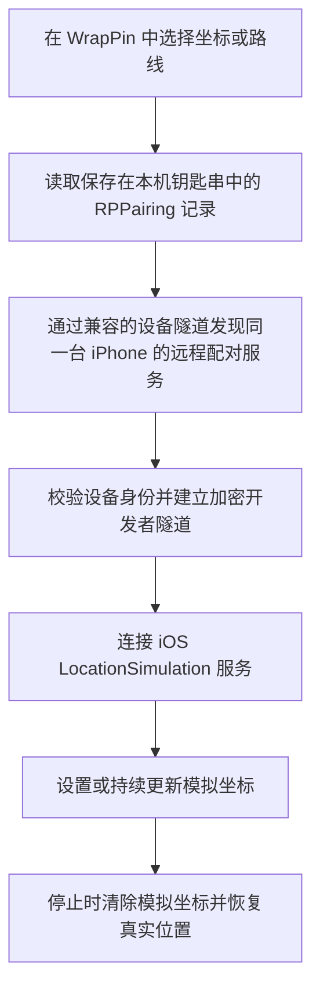

  <picture>
    <source media="(prefers-color-scheme: dark)" srcset="Design/WrapPin-AppIcon-Dark.png">
    <source media="(prefers-color-scheme: light)" srcset="Design/WrapPin-AppIcon-Light.png">
    
  </picture>

<h1 align="center">WrapPin</h1>

  在一张地图上选择、测试并移动 iPhone 向系统报告的位置。

  <strong>简体中文</strong> · <a href="README.en.md">English</a>

  <strong>当前版本：</strong>1.0.15（Build 48） · <strong>系统要求：</strong>iOS 27+

  
  
  
  
  

  <a href="https://github.com/suversal/WrapPin/releases/latest">下载最新版</a> ·
  <a href="Documentation/UserGuide.zh-CN.md">使用手册</a> ·
  <a href="https://x.com/suversal">在 X 联系 @suversal</a>

WrapPin 是 Sean Howarth 原项目 [Roam Control](https://github.com/seanhowarthdev/Roam-Control) 的非官方社区中文分支，由 suversal 维护。上游提供设备配对、固定位置、模拟步行和真实位置恢复等核心能力；WrapPin 在此基础上完成简体中文界面与地图标签本地化、首次使用和连接引导、地址与坐标复制、连接诊断、坐标模式选择、路线预览和版本更新提醒。项目保留原作者署名和上游链接，不代表上游官方中文版。

如果这个项目帮到了你，欢迎点一个 **Star**；如果你发现界面、文案、兼容性或连接流程还有改进空间，也欢迎提交 Issue 或 Pull Request。贡献前请先阅读 [CONTRIBUTING.md](CONTRIBUTING.md)。

项目面向开发、质量测试和个人负责任测试，支持固定位置、步行与驾车路线、收藏与历史记录，并通过本机配对和兼容的设备隧道建立安全的开发者定位会话。默认使用 LocalDevVPN；设置中的 Shadowrocket 选项只决定跳转目标，不保证普通代理配置能提供所需的设备连接。

> 请只在你拥有并控制的设备上使用。不要用于欺骗他人、伪造证据、规避安全限制，或违反第三方服务规则。

## 当前进展

- 当前公开版本为 **1.0.15（Build 48）**，同一个 Release 提供标准版和隧道版两个 IPA；下载以 [GitHub Releases](https://github.com/suversal/WrapPin/releases/tag/v1.0.15) 为准。
- 标准版（`WrapPin-Standard-…`）供 SideStore 等自签方式安装，使用 LocalDevVPN 等外部隧道。隧道版（`WrapPin-Tunnel-…`）内置设备隧道，主 App 和扩展都需要带 Packet Tunnel 权限的签名配置，免费账号无法签名；它使用独立 App ID，不替换标准版。
- 已完成完整简体中文界面、地图标签本地化、配对与连接引导、中文安装文档和使用手册。
- 已完善地址与坐标复制、连接检测、诊断信息复制、异常会话恢复和真实位置恢复流程。
- 配对和定位启动不再依赖可能受 SideStore 重签 Bundle ID 影响的 `BGTaskScheduler`，并优先使用 LocalDevVPN 端点。
- 已使用正式 Xcode Release Archive 流程生成并校验可供 SideStore 签名的未签名 IPA。
- 已验证前台固定位置、模拟步行和停止恢复流程；长时间锁屏保持仍需更多机型和系统版本测试。
- 可选择设备隧道跳转应用；蜂窝网络下优先使用 LocalDevVPN，Shadowrocket 建议连接 Wi-Fi。不同地图或地点仍可能出现位置偏移，可在两种坐标模式间切换；不能保证所有地点都准确。

## 界面预览

  模拟固定位置 · 模拟步行与驾车路线

> 以上为早期版本截图，仅供了解功能；当前界面、文案和路线卡片布局请以实际安装的版本为准。

## 主要功能

- 使用 Apple 地图搜索地点、输入经纬度，或直接轻点地图选点。
- 固定位置可切换 GCJ-02 修正与 WGS84 原值。地区建议仅作起点；如果显示位置有偏差，可切换另一种方式再核对。
- 一键复制所选地点的可读地址或经纬度坐标。
- 启动固定位置后直接更换坐标，无需重新建立整条连接。
- 预览 Apple 地图步行或驾车路线，有多条路线时最多提供三条供选择；步行支持三档预设或 1–12 公里/小时自定义速度，驾车支持 5–240 公里/小时。
- 在步行期间暂停、继续、原路返回或更换目的地。
- 保存常用地点，快速访问最近使用的位置。
- 会话结束时主动清除模拟坐标并恢复真实位置。
- 为 Wi-Fi 和蜂窝网络提供分开的连接引导与诊断。
- 在设置中选择 LocalDevVPN、Shadowrocket、Surge 或 Loon 作为连接不可用时的跳转应用。Shadowrocket、Surge 和 Loon 需要分别按 [Shadowrocket 配置](Documentation/ShadowrocketIntegration.zh-CN.md)、[Surge iOS 配置](Documentation/SurgeIntegration.zh-CN.md)、[Loon 配置](Documentation/LoonIntegration.zh-CN.md) 启用 `10.7.0.1` 设备通道。
- 打开 App 时检查最新公开版本，有更新时提醒；也可在设置中手动检查、反馈问题或联系维护者。
- 支持深浅色外观、不同地图样式、动态字体、VoiceOver 和“减弱动态效果”。

## 实现原理

WrapPin 走的是 iOS 的**开发者位置模拟通道**，不是通过代理伪造 IP，也不是修改 Apple 账号或 App Store 地区。

具体过程如下：

1. WrapPin 在当前 iPhone 上生成或导入 RPPairing 配对记录，并保存到仅本机可访问的钥匙串。
2. LocalDevVPN 暴露 iPhone 自己的远程配对服务，WrapPin 通过本地服务发现找到它。这里的“VPN”用于**本机设备通信**，不会提供出口节点，也不会改变公网 IP。
3. 原生引擎校验广播中的设备身份，完成远程配对验证，再建立加密的开发者隧道。
4. WrapPin 通过 iOS 的 LocationSimulation 服务设置坐标。固定位置会定期刷新；步行模式则沿 Apple 地图规划的路线连续更新坐标。
5. 正常停止时，WrapPin 会向系统发送清除模拟位置的指令。若 App 意外退出，下次打开会进入恢复流程。

SwiftUI 界面与原生定位会话之间通过一层精简的 Rust-to-Swift 桥接连接，底层使用固定版本的 MIT 许可 [`idevice`](https://github.com/jkcoxson/idevice) 库。

## 与 WLOC 的区别

这里的 **WLOC** 指通过 Packet Tunnel、代理和本地 CA 改写 Apple `/clls/wloc` Wi-Fi/基站定位响应的一类实现，不特指某一个仓库。不同 WLOC 分支的系统兼容性和安装方式并不完全相同。

| 对比项 | WrapPin | WLOC 类方案 |
| --- | --- | --- |
| 核心原理 | 使用 iOS 开发者位置模拟服务设置坐标 | 拦截并改写 Apple 的 Wi-Fi/基站网络定位响应 |
| 主要影响 | 系统向 App 报告的开发者模拟位置 | 网络定位结果；硬件 GPS 仍可能覆盖它 |
| 公网 IP | **不会改变** | **不会改变**，除非另行使用出口代理/VPN |
| 前置条件 | iOS 27+、开发者模式、本机配对、LocalDevVPN | Packet Tunnel/代理环境、本地 CA；具体要求随实现变化 |
| 证书信任 | 不需要安装 MITM 根证书 | 通常需要安装并信任本地 CA |
| 签名门槛 | 可用 SideStore 或个人开发签名安装，受 Apple 侧载限制 | 原生 Packet Tunnel 版本通常还需要相应 entitlement，部分实现要求付费开发者账号 |
| 使用体验 | 固定位置、路线预览、模拟步行、收藏和恢复流程集成在 App 内 | 通常围绕隧道、证书和目标坐标配置，能力取决于具体客户端 |
| 主要风险点 | iOS 开发者服务或远程配对协议变化；可能与其他 VPN 同时占用系统隧道 | Apple 定位接口的 TLS 校验、缓存和返回格式变化；MITM 方案可能直接失效 |
| 停止方式 | 主动调用系统服务清除模拟位置 | 停止隧道/重写后等待真实网络定位重新生效，可能受缓存影响 |

WLOC 的优点是思路直接，在兼容系统和已有代理环境中可以只处理网络定位；它的缺点是依赖 HTTPS 中间人和网络定位链路，证书、Packet Tunnel 权限、GPS 覆盖以及 iOS 版本变化都会影响结果。部分 WLOC 分支报告 iOS 27 的 TLS 校验变化会阻断旧实现，而另一些分支声称已适配，因此不能把某个分支的结论当成整个 WLOC 方案的统一兼容性保证。

参考实现与说明：[bennix/WLOC](https://github.com/bennix/WLOC)、[Yu9191/wloc](https://github.com/Yu9191/wloc)、[OpenHRTT/wloc](https://github.com/OpenHRTT/wloc)、[H1d3r/wloc-iOS](https://github.com/H1d3r/wloc-iOS)。

### 怎么选

- 如果你的设备是 iOS 27+，希望使用系统开发者模拟通道、模拟连续步行，并且不想安装 MITM 根证书，优先考虑 WrapPin。
- 如果你只研究 Wi-Fi/基站网络定位、已经了解代理和证书信任，并且确认目标 iOS 版本与某个 WLOC 实现兼容，可以评估对应 WLOC 分支。
- 如果目标是更改公网 IP、Apple 账号地区、App Store 商店地区或运营商归属，**两者都不适用**。

## 优点与已知限制

WrapPin 的主要优点：

- 使用开发者位置模拟通道，不需要解密或改写 Apple 定位请求。
- 不需要在系统中信任自签名 MITM 根证书。
- 固定位置和连续步行使用同一套连接，支持会话内更新。
- 配对记录、搜索、收藏、历史和路线均留在 iPhone 本地。
- 提供明确的停止、真实位置恢复和异常中断恢复流程。

当前限制：

- 只支持 iOS 27 或更高版本的实体 iPhone；模拟器只能检查界面。
- 必须开启开发者模式，并完成一次本机配对。
- LocalDevVPN 用于本机隧道，通常不能和另一个正在接管系统 VPN 的工具同时工作。
- SideStore 免费签名受 Apple 的七天刷新、App 数量和 App ID 数量限制。
- 某些 App 会同时检查 IP、Wi-Fi、基站、账号地区、历史缓存或风控信号，因此不保证所有第三方 App 都接受模拟位置。
- 开发者位置模拟不改变 Apple Watch 的地区资格，也不改变 iPhone 的 eSIM、运营商或卫星功能资格；地图显示在国外不等于这些系统功能可用。
- 已验证前台固定位置、步行和停止恢复流程；长时间锁屏保持仍需更多真机测试，不作稳定性保证。

## 安装前准备

下面以免费路线为例：**iLoader + SideStore + LocalDevVPN + WrapPin**。

你需要：

- 一台运行 iOS 27 或更高版本的实体 iPhone，并已设置锁屏密码。
- 一台 Mac、Windows 或 Linux 电脑，只在第一次安装 SideStore 时使用。
- 一根可以传输数据的 USB 线。
- 一个 Apple 账号，免费账号即可。
- Wi-Fi。SideStore 安装或刷新 App 时需要同时连接 Wi-Fi 和 LocalDevVPN。

各工具请从官方入口下载：

| 工具 | 安装位置 | 入口 |
| --- | --- | --- |
| iLoader | 电脑 | [iloader.app](https://iloader.app/) |
| SideStore | iPhone，由 iLoader 安装 | [SideStore 安装文档（请阅读英文版）](https://docs.sidestore.io/docs/installation/prerequisites) |
| LocalDevVPN | iPhone | [App Store](https://apps.apple.com/app/localdevvpn/id6755608044) |
| WrapPin IPA | iPhone | [GitHub Releases](https://github.com/suversal/WrapPin/releases/latest) |

WrapPin 暂未通过 App Store 或 TestFlight 分发，以 GitHub Release 中的未签名 IPA 为主，需要签名后安装。不要使用来源不明的网盘或镜像，安装包可能被重新打包。

### 选择版本

每个 Release 提供两个 IPA，功能相同。

| | 标准版 `WrapPin-Standard-…` | 隧道版 `WrapPin-Tunnel-…` |
| --- | --- | --- |
| 设备隧道 | 使用 LocalDevVPN | 内置，自动连接 |
| 签名要求 | 免费 Apple 账号，通过 SideStore | 带 Packet Tunnel 权限的付费证书 |
| 续签 | 每七天 | 取决于证书 |

**不确定选哪个就下载标准版**，下面的安装步骤以它为准。隧道版不能用免费账号或 SideStore 签名，有付费证书请看[隧道版](#隧道版)。

## 安装步骤

### 1. 在 iPhone 上安装 LocalDevVPN

1. 从 App Store 安装 [LocalDevVPN](https://apps.apple.com/app/localdevvpn/id6755608044)。国区商店无法下载，请使用美区等其他地区的账号。
2. 打开后轻点 **Connect**。
3. 允许它添加 VPN 配置，并输入锁屏密码。
4. 确认它显示已连接。

名称里虽然有 VPN，但它不会改变公网 IP，也不能代理上网，只是让 SideStore 和 WrapPin 访问 iPhone 本机的服务。开启它会断开手机上正在运行的其他代理或 VPN。

### 2. 用 iLoader 安装 SideStore

1. 在电脑上安装 [iLoader](https://iloader.app/)。
2. 用数据线连接并解锁 iPhone；如果出现“要信任此电脑吗”，选择“信任”并输入锁屏密码。
3. 打开 iLoader，确认设备列表里出现了这台 iPhone。找不到时先换一根数据线，再确认 Finder、iTunes 或 Apple Devices 能看到这台 iPhone。
4. 在 iLoader 中登录 Apple 账号，按提示输入双重认证验证码。
5. 选择这台 iPhone，选择最新的 **SideStore (Stable)**。如果想使用本教程测试时的同一版本，见下方说明。
6. 等待签名和安装完成，中途不要拔线。

请使用最新的 SideStore Stable 版本，或本教程测试时使用的版本。其他版本尤其是旧版本，在 iOS 27 上很可能出问题。

本教程测试使用的是 Nightly 构建 `SideStore-0.7.0-20260914.1447+1fce70de.ipa`，测试时间为 2026 年 9 月，因为当时的 Stable 版本无法使用。安装这个版本的方法：

1. 登录 GitHub，下载[这个构建产物](https://github.com/SideStore/SideStore/actions/runs/34800395893/artifacts/10331626491)，解压后找到上述 IPA。
2. 按上面的第 1–4 步操作，并在 iLoader 中选中这台 iPhone。
3. 点 **INSTALLERS → Import IPA**，选择该 IPA，按提示完成安装。不要点 **SideStore (Nightly)**，它会下载当前的 Nightly 新版，而不是测试用的版本。
4. 打开 SideStore，核对底部版本是否为 `0.7.0-20260914.1447+1fce70de`。

如果已经安装了其他版本的 SideStore，先用之前的同一个 Apple 账号尝试直接覆盖安装。提示不能覆盖时，在 iPhone 上删除 SideStore，再重做第 3 步。删除会清掉原来的配对文件，所以安装后要在 iLoader 点 **Manage Pairing File**，在 SideStore 旁点 **Place**，放置成功后再打开 SideStore。

GitHub 的构建产物有保留期限，上面的下载链接可能失效；失效后请使用最新的 Stable 版本。

如果 iLoader 询问是否撤销已有证书，先确认这个 Apple 账号有没有给其他侧载工具使用；撤销证书可能让此前用它签名的 App 失效。

### 3. 信任开发者并开启开发者模式

1. 打开“设置 → 通用 → VPN 与设备管理”，在“开发者 App”下选择你的 Apple 账号，轻点“信任”。
2. 打开“设置 → 隐私与安全性 → 开发者模式”并开启。
3. 按提示重启 iPhone，重启并解锁后再次确认开启。

开启开发者模式不需要付费加入 Apple Developer Program。WrapPin 依赖开发者模式，这一步不能跳过。如果暂时看不到“开发者模式”开关，先确认 SideStore 已安装并完成信任，再重新检查。

如果 Apple 提示账号没有可用的开发团队，登录 [developer.apple.com/register](https://developer.apple.com/register/) 并接受协议即可，这一步免费。

### 4. 第一次刷新 SideStore

1. 连接 Wi-Fi，并连接 LocalDevVPN。
2. 打开 SideStore，用在 iLoader 中使用的同一个 Apple 账号登录。
3. 进入 **My Apps**，轻点 SideStore 右侧的 **7 DAYS** 刷新一次。
4. 如果弹出创建新证书的提示，按页面说明继续。

这次刷新成功后，SideStore 才算安装完整，日常使用不再需要电脑。

### 5. 下载 WrapPin IPA

1. 打开 [GitHub Releases](https://github.com/suversal/WrapPin/releases/latest)，下载 `WrapPin-Standard-…-unsigned.ipa`。
2. 保存到 iPhone 的“文件”App。如果是在电脑上下载的，可以用 AirDrop、iCloud Drive 或数据线传到手机。

每个 Release 都列出了 IPA 的 SHA-256。需要校验时，在 Mac 终端运行 `shasum -a 256 文件名.ipa`，确认结果与 Release 页面一致。

### 6. 用 SideStore 侧载 WrapPin

> [!IMPORTANT]
> 不要在 SideStore 中使用“通过 URL 安装”或直接粘贴 GitHub Release 的 IPA 链接。部分 SideStore 版本会把远程文件名误当成 Bundle ID，从而出现 Bundle ID 不匹配的安装错误。请先将 IPA 保存到 iPhone 的“文件”App，再从本地选择。

1. 确认 Wi-Fi 和 LocalDevVPN 都已连接。
2. 打开 SideStore，进入 **My Apps**。
3. 轻点 **+**，从“文件”中选择 WrapPin 的 IPA。
4. 等待 SideStore 完成签名和安装。期间保持 SideStore 打开，不要断开 Wi-Fi 或 LocalDevVPN。
5. 回到桌面确认 WrapPin 图标已经出现。

以后更新 WrapPin 时直接用新 IPA 覆盖安装，不要先删除旧版；删除 App 会清掉收藏、历史和设置，并可能需要重新配对。

更多说明见[安装与侧载](Documentation/Installation.zh-CN.md)。

## 第一次连接

1. 打开 WrapPin，完成首次使用说明。
2. 进入“设备连接”，轻点“配对本机”。
3. iOS 询问时，允许本地网络权限。
4. 打开“设置 → 隐私与安全性 → 开发者模式 → 与 WrapPin 配对”。
5. 如果系统要求，先输入 iPhone 锁屏密码，再输入 WrapPin 显示的六位数配对码；这是两个不同的码，配对码也可以在通知中查看。
6. 回到 WrapPin，确认设备状态显示已配对。
7. 打开 LocalDevVPN，允许它创建 VPN 配置并连接本地隧道。
8. 若正在使用其他代理或 VPN，先暂停其系统隧道，再回到 WrapPin 开始连接。

一般只需配对一次。配对记录保存在 iPhone 钥匙串中，不会上传。

## 模拟固定位置

1. 搜索地点、输入经纬度、轻点地图，或从收藏和历史记录中选择位置。
2. 在地点卡片上选择模拟坐标模式。国内地点建议先试 GCJ-02，其他地点建议先试 WGS84；这只是初始建议。
3. 检查地图上的位置点，轻点“开始模拟定位”。如果出现 LocalDevVPN 或蜂窝网络提示，按页面引导操作。
4. 等待状态显示“模拟定位中”，再打开 Apple 地图核对实际显示位置。若有偏差，返回 WrapPin 切换另一种模式；同一地点的模拟坐标会随之更新。
5. 需要换地点时，在 WrapPin 中选择新位置并轻点“更换模拟位置”，无需重新配对。
6. 测试结束后回到 WrapPin，轻点“停止模拟并恢复”，保持 App 在前台直到恢复完成。

## 模拟步行路线

1. 选择目的地，轻点“预览步行”。
2. 检查 Apple 地图返回的路线、距离、预计用时和到达时间；有多条路线时可在卡片上选择，或直接轻点地图上的路线。
3. 选择三档预设步速，或启用 1–12 公里/小时的自定义步速，轻点“开始模拟步行”。
4. 步行期间可以暂停、继续、原路返回，或在保持连接的情况下更换目的地。
5. 结束时使用“停止模拟并恢复”，不要只强制退出 App。

## 模拟驾车路线

1. 选择目的地，轻点“预览驾车”，确认路线经过的道路。
2. 在预览中设置 5–240 公里/小时的匀速模拟速度，再轻点“开始模拟驾车”。预计用时按模拟速度计算，并非实时路况预测。
3. 行进中可暂停或继续；到达后模拟位置会留在目的地。结束时轻点“停止模拟并恢复”，确认真实位置已恢复。

## Wi-Fi 与蜂窝网络

使用 Wi-Fi 时，确认 LocalDevVPN 显示已连接。如果 WrapPin 一直停在“正在查找这台 iPhone”，先关闭再开启 LocalDevVPN 隧道，然后轻点“重试”。

使用 4G/5G 时：

1. 在 WrapPin 中启动所选位置。
2. 页面提示后暂时关闭蜂窝网络。
3. 回到 WrapPin，等待它发现本机；必要时轻点“继续”。
4. 安全连接建立后，按提示重新开启蜂窝网络。

临时关闭蜂窝网络只用于建立本机连接。定位会话启动后，可以恢复正常使用移动数据。

## SideStore 日常刷新

免费 Apple 账号签名的 App 七天后过期。只要 SideStore 自己还没过期，就可以直接在 iPhone 上续签，不需要电脑。

1. 连接 Wi-Fi，并连接 LocalDevVPN。
2. 打开 SideStore，进入 **My Apps**。
3. 轻点 **Refresh All**，或轻点各 App 右侧的剩余天数。
4. 等待 SideStore 和 WrapPin 都刷新成功。

刷新只是延长签名有效期，不会删除 WrapPin 的数据。如果 SideStore 自己已经过期，它无法打开，也无法给自己续期：这时重新连接电脑，用 iLoader 覆盖安装 SideStore，再回到手机刷新各 App。

七天期限以及 App 和 App ID 的数量限制是 Apple 对免费账号的规定，不是 WrapPin 的订阅规则。

## 隧道版

隧道版自带设备隧道，不需要 LocalDevVPN。主 App 和内嵌扩展都必须用付费证书签名，并且描述文件要授予 Packet Tunnel（Network Extension）权限。

签名有两种方式，以下只是大致步骤：

- **付费证书加 iPhone 上的签名工具。** 把证书和描述文件导入 IPA 签名工具，再导入 `WrapPin-Tunnel-…-unsigned.ipa`，签名并安装。事先确认证书支持 VPN / Network Extension 类 App。本项目不提供、不推荐也不担保任何证书服务。
- **Xcode 加付费 Apple Developer 账号。** 在 `Configuration/Local.private.xcconfig` 中填入自己的团队和 Bundle ID，选择 **WrapPin Tunnel** scheme 并运行到 iPhone。这条路线维护者没有实测。

安装之后：

1. 按本文的说明开启开发者模式并完成本机配对，两个版本都需要。
2. 首次启动隧道时，允许 WrapPin Tunnel 添加 VPN 配置。
3. 开始模拟定位。在设置中选择“使用内置隧道”后，隧道会在会话开始时自动连接，并在恢复真实位置后自动断开。

本文中凡是要求先连接 LocalDevVPN 再使用 WrapPin 的地方，隧道版都由内置隧道代替。更多说明见[安装与侧载](Documentation/Installation.zh-CN.md)。

## 停止、恢复与排障

正常结束时务必在 WrapPin 内停止会话。恢复完成前，不要使用导航、出行、紧急求助或位置共享类 App。

如果 App 意外退出，重新打开后会出现恢复页面，可以继续上次任务，或选择“恢复真实位置”。恢复页面不会自动开始任何操作。

常见问题：

- **SideStore 提示没有 Wi-Fi 或 LocalDevVPN：**确认两者都已连接，关闭其他 DNS、代理或 VPN 工具，再重启 LocalDevVPN 和 SideStore。
- **SideStore 安装 IPA 卡在中途：**先确认使用的是最新的 SideStore Stable 或“安装步骤”第 2 步中的测试版本。然后依次尝试重新打开 SideStore、清理缓存、切换 Anisette Server、重启 iPhone；仍然失败时，用 iLoader 重新放置配对文件或重装 SideStore。
- **SideStore 的配对文件失效：**系统升级或还原设备都可能导致失效。连接电脑，在 iLoader 中删除旧配对并重新信任，再通过 **Manage Pairing File** 把新的配对文件放入 SideStore。
- **停止后位置没有立即恢复：**重新打开 WrapPin，选择“恢复真实位置”并保持 App 在前台，再用 Apple 地图核对；必要时关闭并重新开启“定位服务”。
- **一直找不到 iPhone：**确认 LocalDevVPN 已连接、关闭其他系统 VPN、重新开关 LocalDevVPN，并确认配对记录属于当前设备。
- **提示配对记录失效：**移除旧配对后重新执行“配对本机”。
- **某个 App 的位置没变：**先用 Apple 地图确认。目标 App 可能仍在使用缓存、IP、Wi-Fi、基站或账号地区。
- **需要提交问题：**打开“设置 → 连接检测”，运行检查并复制诊断信息。不要上传配对文件、PIN、签名材料、账号凭据或私人位置。

更完整的操作说明见[使用手册](Documentation/UserGuide.zh-CN.md)。

## 从源码编译

1. 克隆仓库，使用 Xcode 27 或更高版本打开 `WrapPin.xcodeproj`。
2. 选择 **WrapPin Standard** scheme。
3. 在 `WrapPinStandard` target 的 **Signing & Capabilities** 中选择你自己的 Apple 开发者团队。
4. 连接实体 iPhone，选择该设备并按 **Run**。

工程文件、target、scheme 和源码目录使用内部标识 `WrapPin`；安装后的 App 名称显示为 `WrapPin`。

普通构建直接使用仓库中的 `Frameworks/WrapPinPairingFFI.xcframework`。只有修改 `Native/WrapPinPairingFFI` 后才需要重新构建框架，步骤见[构建与发布指南](Documentation/BuildAndRelease.md)。

## 隐私与许可证

位置、坐标、搜索、收藏、历史记录、步行路线和配对记录均保存在 iPhone 本地。打开 App 时会向 GitHub 查询最新公开版本，但不会随请求发送位置或配对数据。匿名使用统计默认关闭；启用后也不会发送位置、搜索、路线、配对数据、设备名称或诊断原文。详见[隐私说明](Documentation/Privacy.md)。

项目当前使用 [PolyForm Noncommercial License 1.0.0](LICENSE)，源代码可查看，并允许按条款进行非商业使用、修改和分发；它不是 OSI 认可的开源许可证。第三方依赖保留各自的许可证。

本版本的改动和验证范围见 [CHANGELOG](CHANGELOG.md)。

## 反馈与贡献

普通问题和可复现的故障请使用本仓库的 [GitHub Issues](https://github.com/suversal/WrapPin/issues)。安全问题请通过 GitHub Security Advisories 私下报告。提交内容前请删除配对文件、PIN、签名材料、账号凭据和私人位置。

交流和使用反馈也可以通过 X 联系维护者 [@suversal](https://x.com/suversal)；App 内入口位于“设置 → 社区 → 关注我”。

本项目由 suversal 作为非官方社区分支维护。核心实现来源、原作者版权声明、上游项目链接和第三方许可证均予以保留。
